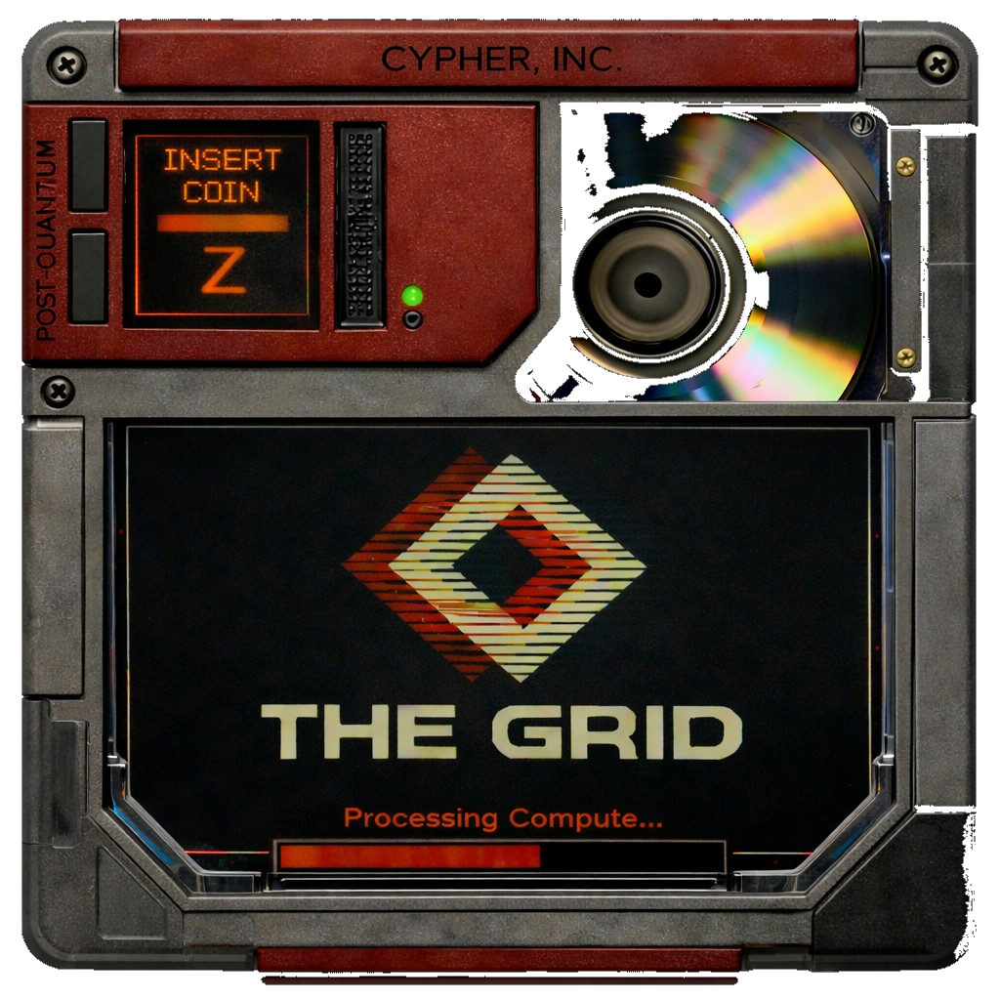

<p align="center">
  
</p>

---

&nbsp;

<p align="center">
  <strong>The Global Resilient Internet Datalink</strong><br/>
  A decentralized compute environmnet powered by zero-knowledge proofs and post-quantum cryptography.
</p>

<p align="center">
  <a href="#overview">Overview</a> &nbsp;·&nbsp;
  <a href="docs/run-a-zode.md">Run a ZODE</a> &nbsp;·&nbsp;
  <a href="#principles">Principles</a> &nbsp;·&nbsp;
  <a href="docs/grid-protocol.md">Protocol Spec</a>
</p>

## Overview

The GRID is a general-purpose distributed computing network secured by zero-knowledge proofs and post-quantum cryptography.

It allows anyone to contribute unused compute capacity to a verifiable, decentralized execution layer for internet services. The network supports encrypted storage, decentralized identity, and AI workloads (including inference, agent sandboxing, and training), without requiring trust in operators.

The objective is to build a global, decentralized alternative to traditional hyperscale cloud infrastructure that is faster, lower cost, cryptographically verifiable, and aligned with sovereignty, privacy, and long-term security.

## ZODE

**ZODE** is the reference implementation of [The GRID Protocol](docs/grid-protocol.md): a local node that receives, verifies, and serves data across a peer-to-peer network.

Core concepts:

- **Sectors** — The fundamental unit of data on the network. Each sector is encrypted client-side (Poseidon sponge + hybrid ChaCha20-Poly1305 envelope), propagated via GossipSub, and persisted locally in RocksDB. Plaintext never touches the wire.
- **Programs** — Application-level namespaces that organize sectors by purpose. Built-in programs include ZID (decentralized identity) and Interlink (encrypted messaging). Nodes subscribe to the programs they care about.
- **Proofs** — Zero-knowledge proofs that let nodes verify a sector is correctly shaped and encrypted without ever seeing its contents. The initial backend is Groth16 over BN254, with the architecture designed to support additional proof systems as they mature.

Two frontends ship in this workspace:

- **zode-app** — a standalone desktop GUI built with eframe / egui.
- **zode-cli** — a console TUI built with ratatui / crossterm.

See [Run a ZODE](docs/run-a-zode.md) for prerequisites, build instructions, and configuration.

## Principles

1. **Agency:** Your key material is your account. Identity keys are generated on-device via Shamir secret sharing; shares never leave your machines. No server, no custodian.
2. **Privacy:** Data is encrypted client-side (Poseidon sponge + hybrid ChaCha20-Poly1305 envelope) before it touches the network. Zero-knowledge proofs let nodes verify sector validity without seeing plaintext.
3. **Decentralization:** Fully peer-to-peer over libp2p/QUIC. GossipSub propagation, request-response exchange, optional Kademlia DHT. No central server; any node can join or leave freely.
4. **Post-Quantum:** PQ-hybrid cryptography: Ed25519 + ML-DSA-65 signing, X25519 + ML-KEM-768 key agreement. Sector encryption uses ZK-friendly Poseidon over BN254.
5. **Open Source:** MIT-licensed Rust workspace. Every layer is auditable and reusable.

## Architecture

| Crate | Description |
|---|---|
| `zid` | PQ-hybrid key generation, HKDF derivation, Ed25519 + ML-DSA-65 signing, ML-KEM-768 encapsulation |
| `grid-core` | Shared types, canonical CBOR serialization, and protocol messages |
| `grid-crypto` | Client-side encryption: Poseidon sponge sector encryption and hybrid key wrapping |
| `grid-storage` | Storage abstraction over RocksDB: `SectorStore` trait, `RocksStorage` backend, sector stats |
| `grid-proof` | Pluggable Valid-Sector proof verification trait |
| `grid-proof-groth16` | Groth16 shape+encrypt circuit, prover, verifier, and trusted setup |
| `grid-net` | libp2p network abstraction: QUIC transport, GossipSub topics, request-response protocol, Kademlia DHT |
| `grid-sdk` | Client SDK: identity, encrypt, sign, upload, fetch |
| `zode` | Core node logic tying together storage, network, proof, and programs |
| `grid-programs/zid` | ZID (Zero Identity) program descriptor and messages |
| `grid-programs/interlink` | Interlink (chat) program descriptor and messages |
| `grid-programs/zfs` | ZFS file-system program (placeholder) |
| `zode-app` | Standalone desktop GUI for the Zode |
| `zode-cli` | Console TUI for the Zode |

## Project Structure

```
zfs/
  Cargo.toml              # workspace root
  crates/
    zid/                  # PQ-hybrid key generation and signing
    grid-core/            # shared types, CBOR, protocol messages
    grid-crypto/          # Poseidon encryption, hybrid key wrapping
    grid-storage/         # RocksDB storage backend
    grid-proof/           # proof verification trait
    grid-proof-groth16/   # Groth16 ZK circuit and prover
    grid-net/             # libp2p networking layer
    grid-sdk/             # client SDK
    zode/                 # core node logic
    zode-app/             # desktop GUI (eframe/egui)
    zode-cli/             # console TUI (ratatui/crossterm)
    grid-programs/
      zid/                # Zero Identity program
      interlink/          # chat program
      zfs/                # file-system program (placeholder)
```

## License

MIT
