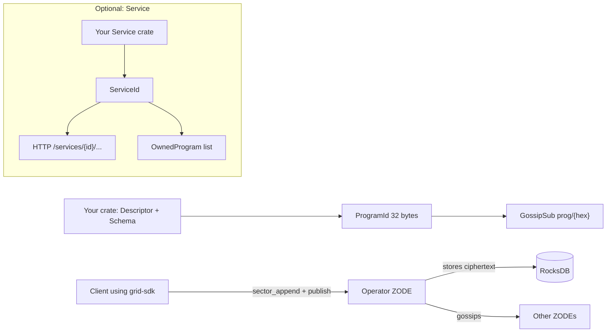

# Build a Program on The GRID

This guide walks a third-party developer through the end-to-end flow for
shipping an application on The GRID:

1. Define a **Program** (a named, versioned data scope).
2. Write a client for it against [`grid-sdk`](../crates/grid-sdk).
3. Optionally pair it with a **Service** (node-side logic that runs on every
   operator's ZODE).
4. Distribute it so that other operators can add your Program to their ZODE.

The protocol-level contract for everything below is defined in
[grid-protocol.md](grid-protocol.md); this document is the implementer's
counterpart.

- [Programs vs Services](#programs-vs-services)
- [Path A — Build a Program](#path-a--build-a-program)
- [Writing a client](#writing-a-client)
- [Path B — Build a Service (optional)](#path-b--build-a-service-optional)
- [How operators add your Program](#how-operators-add-your-program)
- [Versioning and distribution checklist](#versioning-and-distribution-checklist)

---

## Programs vs Services

The GRID exposes two extension points for third-party developers, and it is
worth being precise about which one you need before writing any code.

| Concept | What it is | Where the logic runs | Identity |
|---|---|---|---|
| **Program** | A named, versioned data scope: a topic + message schema + encryption profile. Defined by a `ProgramDescriptor`. | Only on clients. ZODES just store and relay opaque ciphertext. | `ProgramId = SHA-256(CBOR(ProgramDescriptor))` |
| **Service** | Node-side executable logic mounted into every operator's ZODE. Can own one or more Programs, expose HTTP routes, subscribe to gossip, run background tasks. Defined by a `ServiceDescriptor`. | Inside the ZODE process. | `ServiceId = SHA-256(CBOR(ServiceDescriptor))` |



Most applications start as a Program-only design. Reach for a Service only
when you need code to run *inside* the ZODE itself (consensus, indexing,
mailbox queues, etc.).

---

## Path A — Build a Program

A Program is a small Rust crate that defines a descriptor, a message schema,
and message types. Use [`grid-programs/zid`](../crates/grid-programs/zid) as a
minimal reference and [`grid-programs/interlink`](../crates/grid-programs/interlink)
as a reference with signatures + Groth16 shape proofs.

### 1. Create the crate

```toml
[package]
name = "grid-programs-myapp"
version = "0.1.0"
edition = "2021"
license = "MIT OR Apache-2.0"

[dependencies]
grid-core = { path = "../../grid-core" }
serde = { version = "1", features = ["derive"] }
serde_bytes = "0.11"
sha2 = "0.10"
```

### 2. Write the descriptor

The descriptor is the hashed object that pins down your program's identity.
Fields chosen here are permanent: any change produces a new `ProgramId`.

```rust
use grid_core::{GridError, ProgramId, ProofSystem};
use serde::{Deserialize, Serialize};

#[derive(Debug, Clone, PartialEq, Eq, Serialize, Deserialize)]
pub struct MyAppDescriptor {
    pub name: String,
    pub version: u32,
    pub proof_required: bool,
    #[serde(default, skip_serializing_if = "Option::is_none")]
    pub proof_system: Option<ProofSystem>,
}

impl MyAppDescriptor {
    pub fn v1() -> Self {
        Self {
            name: "myapp".into(),
            version: 1,
            proof_required: true,
            proof_system: Some(ProofSystem::Groth16),
        }
    }

    pub fn program_id(&self) -> Result<ProgramId, GridError> {
        let canonical = grid_core::encode_canonical(self)?;
        Ok(ProgramId::from_descriptor_bytes(&canonical))
    }

    pub fn topic(&self) -> Result<String, GridError> {
        Ok(grid_core::program_topic(&self.program_id()?))
    }
}
```

The `ProgramId` derivation — `SHA-256(canonical_cbor(descriptor))` — is the
same one defined in [`grid-protocol.md §4.1`](grid-protocol.md#41-programid)
and implemented in [crates/grid-programs/zid/src/zid.rs](../crates/grid-programs/zid/src/zid.rs).
Two independent implementations that serialize the same descriptor fields
MUST produce the same 32-byte ID.

### 3. Pick an encryption profile

- `proof_system = None` → payloads are encrypted with XChaCha20-Poly1305.
  Cheap and simple; no shape proofs.
- `proof_system = Some(ProofSystem::Groth16)` → payloads use Poseidon sponge
  encryption and each entry carries a Groth16 shape proof that binds the
  ciphertext to a declared field schema. See
  [`grid-protocol.md §13`](grid-protocol.md#13-shape-proofs).

### 4. Declare the message schema (Groth16 only)

When you opt into `Groth16`, you must also declare a `FieldSchema` so that
shape proofs can be bound to a deterministic `schema_hash`. The primitives
live in [crates/grid-core/src/field_schema.rs](../crates/grid-core/src/field_schema.rs).

```rust
use grid_core::{CborType, FieldDef, FieldSchema};

impl MyAppDescriptor {
    pub fn field_schema() -> FieldSchema {
        FieldSchema {
            program_name: "myapp".into(),
            version: 1,
            fields: vec![
                FieldDef { key: "sender_did".into(),   value_type: CborType::TextString,  optional: false },
                FieldDef { key: "payload".into(),      value_type: CborType::ByteString,  optional: false },
                FieldDef { key: "timestamp_ms".into(), value_type: CborType::UnsignedInt, optional: false },
                FieldDef { key: "signature".into(),    value_type: CborType::ByteString,  optional: false },
            ],
        }
    }
}
```

### 5. Define your message type

Messages are just CBOR-serializable structs. Follow the pattern from
`ZMessage` in [crates/grid-programs/interlink/src/interlink.rs](../crates/grid-programs/interlink/src/interlink.rs):

```rust
#[derive(Debug, Clone, PartialEq, Eq, Serialize, Deserialize)]
pub struct MyAppMessage {
    pub sender_did: String,
    #[serde(with = "serde_bytes")]
    pub payload: Vec<u8>,
    pub timestamp_ms: u64,
    #[serde(with = "serde_bytes", default)]
    pub signature: Vec<u8>,
}

impl MyAppMessage {
    pub fn signable_bytes(&self) -> Result<Vec<u8>, GridError> {
        #[derive(Serialize)]
        struct Signable<'a> {
            sender_did: &'a str,
            payload: &'a [u8],
            timestamp_ms: u64,
        }
        grid_core::encode_canonical(&Signable {
            sender_did: &self.sender_did,
            payload: &self.payload,
            timestamp_ms: self.timestamp_ms,
        })
    }

    pub fn encode_canonical(&self) -> Result<Vec<u8>, GridError> {
        grid_core::encode_canonical(self)
    }
}
```

Keep encoded messages under the per-sector-entry limit (256 KB by default,
enforced by every ZODE via `SectorLimitsConfig::max_slot_size_bytes` in
[crates/zode/src/config.rs](../crates/zode/src/config.rs)).

### 6. Print and publish the ProgramId

Run a one-off `cargo test` or `main` that prints `descriptor.program_id()?`
as hex. That 64-character string is your program's stable identifier — ship
it in your README, any installer, and any documentation you give to
operators. It is the only thing an operator needs to opt in.

---

## Writing a client

Clients use [`grid-sdk`](../crates/grid-sdk) to connect to a ZODE, encrypt
entries, optionally prove their shape, append them, and publish them over
GossipSub. The public surface is re-exported from
[crates/grid-sdk/src/lib.rs](../crates/grid-sdk/src/lib.rs).

A typical write looks like this:

```rust
use grid_sdk::{
    sector_append_with_proof, sector_encrypt_and_prove, Client, Groth16ShapeProver,
    SdkConfig, SectorKey,
};
use grid_crypto::derive_sector_id;

let client = Client::connect(&SdkConfig::default()).await?;

let descriptor = MyAppDescriptor::v1();
let program_id = descriptor.program_id()?;
let schema     = MyAppDescriptor::field_schema();

let sector_id = derive_sector_id(program_id.as_bytes(), b"channel:general");

let msg = MyAppMessage { /* ... */ signature: Vec::new() };
let plaintext = msg.encode_canonical()?;

let prover = Groth16ShapeProver::load_default()?;
let key    = SectorKey::random();

let (ciphertext, shape_proof) = sector_encrypt_and_prove(
    &plaintext, &key, &program_id, &sector_id, &prover, &schema,
)?;

let resp = sector_append_with_proof(
    &client, &program_id, &sector_id, &ciphertext, Some(shape_proof),
).await?;
```

After a successful append, clients are responsible for publishing a
`GossipSectorAppend` to `prog/<program_id_hex>` so the entry fans out to
other subscribed ZODES. The protocol-level rules for this handshake are in
[grid-protocol.md §15.3](grid-protocol.md#153-append--gossip-flow).

Reads use the symmetric helpers in [crates/grid-sdk/src/sector.rs](../crates/grid-sdk/src/sector.rs)
(`sector_read_log`, `sector_log_length`, `sector_decrypt_poseidon`,
`sector_decrypt_and_verify`).

---

## Path B — Build a Service (optional)

A Service is node-side logic that every operator runs. It implements the
`Service` trait from [crates/grid-service/src/service.rs](../crates/grid-service/src/service.rs)
and is registered into the `ServiceRegistry`. Services can own Programs
(the registry will ensure the owning ZODE subscribes to them automatically
via `ServiceRegistry::required_programs`) and expose axum routes under
`/services/{service_id_hex}/`.

Use [crates/grid-services/zephyr/src/service.rs](../crates/grid-services/zephyr/src/service.rs)
as the working reference.

### Service descriptor

`ServiceDescriptor` (see [crates/grid-service/src/descriptor.rs](../crates/grid-service/src/descriptor.rs))
has the same "canonical CBOR → hash" identity story as a Program:

```rust
use grid_service::{OwnedProgram, ServiceDescriptor};

let descriptor = ServiceDescriptor {
    name: "MYAPP".into(),
    version: "0.1.0".into(),
    required_programs: vec![/* existing ProgramIds you read */],
    owned_programs: vec![OwnedProgram {
        name: "myapp".into(),
        version: "1".into(),
        program_id: MyAppDescriptor::v1().program_id()?,
    }],
    summary: "Example third-party service on The GRID.".into(),
};
```

### Implementing the trait

```rust
use async_trait::async_trait;
use axum::{routing::get, Json, Router};
use grid_service::{Service, ServiceContext, ServiceError};

pub struct MyAppService { descriptor: ServiceDescriptor /* , state, channels */ }

#[async_trait]
impl Service for MyAppService {
    fn descriptor(&self) -> &ServiceDescriptor { &self.descriptor }

    fn routes(&self, _ctx: &ServiceContext) -> Router {
        Router::new().route("/status", get(|| async { Json("ok") }))
    }

    async fn on_start(&self, ctx: &ServiceContext) -> Result<(), ServiceError> {
        for owned in &self.descriptor.owned_programs {
            ctx.subscribe_topic(&grid_core::program_topic(&owned.program_id))?;
        }
        Ok(())
    }

    async fn on_stop(&self) -> Result<(), ServiceError> { Ok(()) }
}
```

### What `ServiceContext` gives you

`ServiceContext` (in [crates/grid-service/src/context.rs](../crates/grid-service/src/context.rs))
is the service's window into the ZODE. The important handles are:

- `publish(topic, bytes)` and `send_direct(target, topic, bytes)` for gossip
  and unicast.
- `subscribe_topic` / `unsubscribe_topic` for dynamic subscription
  management.
- `store(&program_id)` → a `ProgramStore` with `get`, `put`, `list`, `len`
  for sector-log-backed key-value access, plus a separate `kv_*` family
  backed by the local index. This lets services replace their own
  databases with GRID Programs.
- `identity()` for signing with the node's PQ-hybrid key.
- `proof_registry()` for standalone Groth16 verification.
- `create_ephemeral_token` / `verify_ephemeral_token` for signed, expiring,
  server-free tokens (useful for stateless auth flows).

### Declaring config (optional)

Services that need operator-tunable knobs declare a `config_schema()` and
implement `current_config()` returning a JSON object. Operators set values
in `ZodeConfig::service_configs` keyed by service name (e.g. `"MYAPP"`).
Zephyr deserializes its `ZephyrConfig` this way in
[crates/zode/src/zode.rs](../crates/zode/src/zode.rs) (`register_default_services`).

### Registering the service on a ZODE (today)

Today services are registered statically inside a ZODE binary. To have
operators run your Service you currently need to ship a ZODE build that
registers it. Adding one looks like this, next to the existing calls in
`register_default_services` in [crates/zode/src/zode.rs](../crates/zode/src/zode.rs):

```rust
match grid_services_myapp::MyAppService::new(my_cfg) {
    Ok(svc) => {
        if let Err(e) = registry.register(Arc::new(svc)) {
            warn!(error = %e, "failed to register myapp service");
        }
    }
    Err(e) => warn!(error = %e, "failed to create myapp service"),
}
```

The simplest path is to fork `zode-bin` / `zode-cli`, add your crate as a
workspace member, and ship the resulting binary. Operators who install that
binary get your Service automatically; the registry will also subscribe
them to every `ProgramId` in `required_programs` and `owned_programs`.

### WASM services (preview)

The long-term deployment story for third-party services is the WASM
component host in [crates/grid-service/src/wasm_host.rs](../crates/grid-service/src/wasm_host.rs).
It is gated behind the `wasm` Cargo feature and currently returns an error
from `load_descriptor`; operators will eventually be able to drop a
`.wasm` component into a configured directory and enable it via
`ZodeConfig`. Until that lands, treat WASM services as preview-only and
target the native registration path above.

---

## How operators add your Program

This is the section to point operators at. It assumes you have already
published:

- The `ProgramId` as a 64-character lowercase hex string.
- A short description of what the Program does and whether it needs a
  Service.

### Program-only (no Service required)

Operators just subscribe their ZODE to the program's GossipSub topic.

**zode-cli** — repeatable `--topic` flag (see
[crates/zode-cli/src/main.rs](../crates/zode-cli/src/main.rs)):

```sh
cargo run -p zode-cli -- \
  --topic <your_64_hex_program_id> \
  --topic <another_program_id>
```

Under the hood this populates `ZodeConfig::topics`, which is unioned with
the enabled default programs in
`ZodeConfig::effective_topics` in [crates/zode/src/config.rs](../crates/zode/src/config.rs):

```108:113:crates/zode/src/config.rs
    pub fn effective_topics(&self) -> HashSet<ProgramId> {
        let mut set = self.default_programs.enabled_program_ids();
        set.extend(&self.topics);
        set
    }
```

**zode-bin (desktop GUI)** — operators add the ProgramId hex through the
Settings → Programs panel. See [run-a-zode.md](run-a-zode.md) for the
settings layout.

After restart the ZODE:

1. Computes the effective topic set (defaults ∪ configured `topics`).
2. Subscribes each `prog/<hex>` topic on GossipSub.
3. Accepts sector `Append` / `ReadLog` requests for that `ProgramId` and
   rejects others with `ProgramMismatch`
   (see [grid-protocol.md §10](grid-protocol.md#10-policy-and-resource-limits)).

Operators do not need to trust your Program for it to transit through their
node: the ZODE only ever sees opaque ciphertext.

### Program + Service (native)

Operators install your forked `zode` binary. On start it registers your
Service, auto-subscribes to every `ProgramId` in `required_programs` and
`owned_programs`, and mounts your routes at `/services/{service_id_hex}/`.

Per-service configuration uses the `service_configs` map in `ZodeConfig`,
keyed by the `ServiceDescriptor.name` you chose (`"MYAPP"` in the example
above). The value is an arbitrary JSON object that your service
deserializes in its constructor.

### Program + Service (WASM)

Tracked by the `wasm` feature flag; see the [WASM services](#wasm-services-preview)
note above. Not ready for production yet.

---

## Versioning and distribution checklist

Before you ship:

- [ ] Published the canonical `ProgramId` hex (and the SHA-256 of the
      descriptor encoding, if you want to pin independent implementations).
- [ ] Published your `grid-programs-myapp` crate (descriptor + schema +
      message types) and a minimal client using `grid-sdk`.
- [ ] Declared a `FieldSchema` if `proof_system = Groth16`. Any change to
      the schema requires bumping `ProgramDescriptor.version` — which is
      by design: a different `version` produces a different `ProgramId`
      and therefore a different, non-overlapping topic.
- [ ] For Services: `ServiceDescriptor.version` follows SemVer; treat the
      `required_programs` list as a stable contract because it determines
      which topics operators will end up subscribed to.
- [ ] Checked against the interop checklist in
      [grid-protocol.md §18](grid-protocol.md#18-interoperability-requirements).
- [ ] Decided whether operators need to run a custom binary (Service) or
      just pass `--topic` (Program only), and documented that clearly.

### Reference implementations in this workspace

| Use case | Crate | Notes |
|---|---|---|
| Program, no proofs | [crates/grid-programs/zid](../crates/grid-programs/zid) | Identity claims, XChaCha20-Poly1305 |
| Program, Groth16 shape proofs | [crates/grid-programs/interlink](../crates/grid-programs/interlink) | Chat messages, Poseidon + proof |
| Program family owned by a Service | [crates/grid-programs/zephyr](../crates/grid-programs/zephyr) | Per-zone Programs + consensus Programs |
| Service implementing the trait | [crates/grid-services/zephyr](../crates/grid-services/zephyr) | Background tasks, gossip handler, HTTP routes, config schema |
| Client SDK entry points | [crates/grid-sdk](../crates/grid-sdk) | Sector append / read / encrypt / prove |
| Operator-side config | [crates/zode/src/config.rs](../crates/zode/src/config.rs) | `ZodeConfig`, `topics`, `service_configs` |

For the protocol invariants underlying all of the above, see
[grid-protocol.md](grid-protocol.md).
