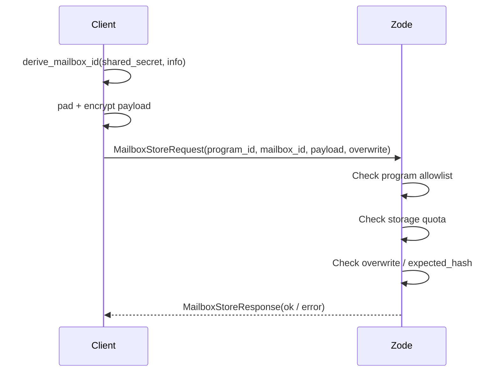
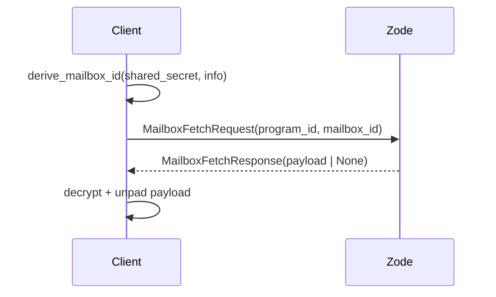
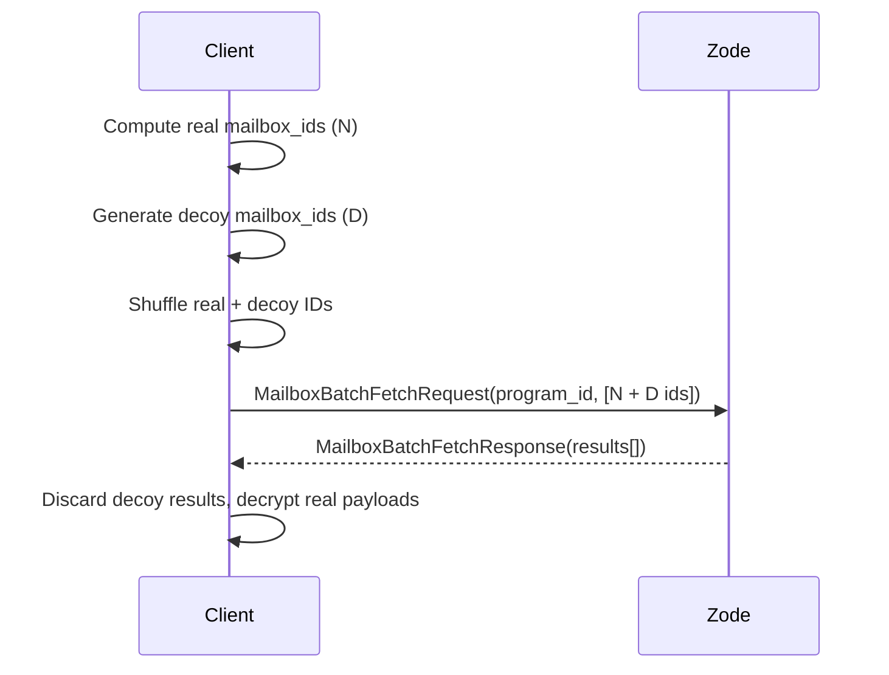
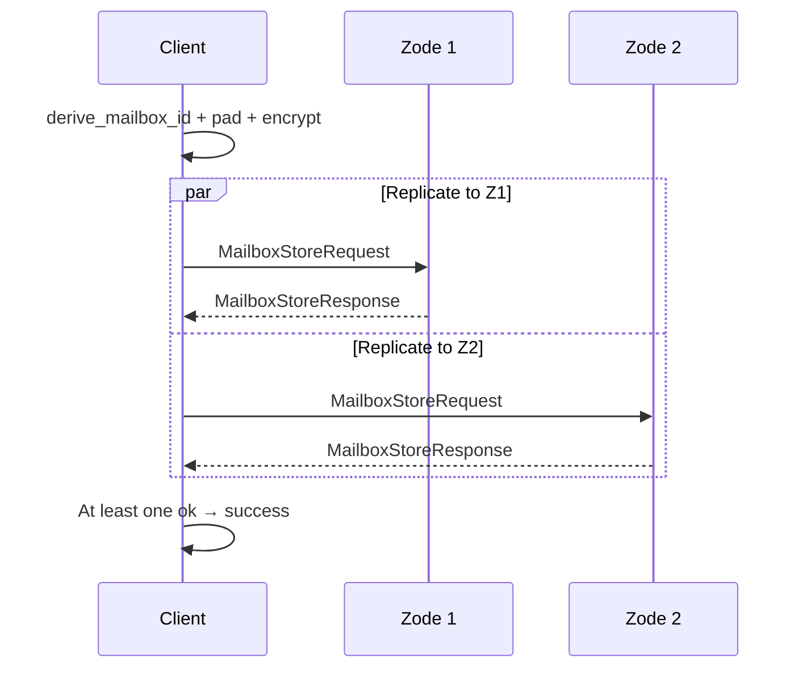
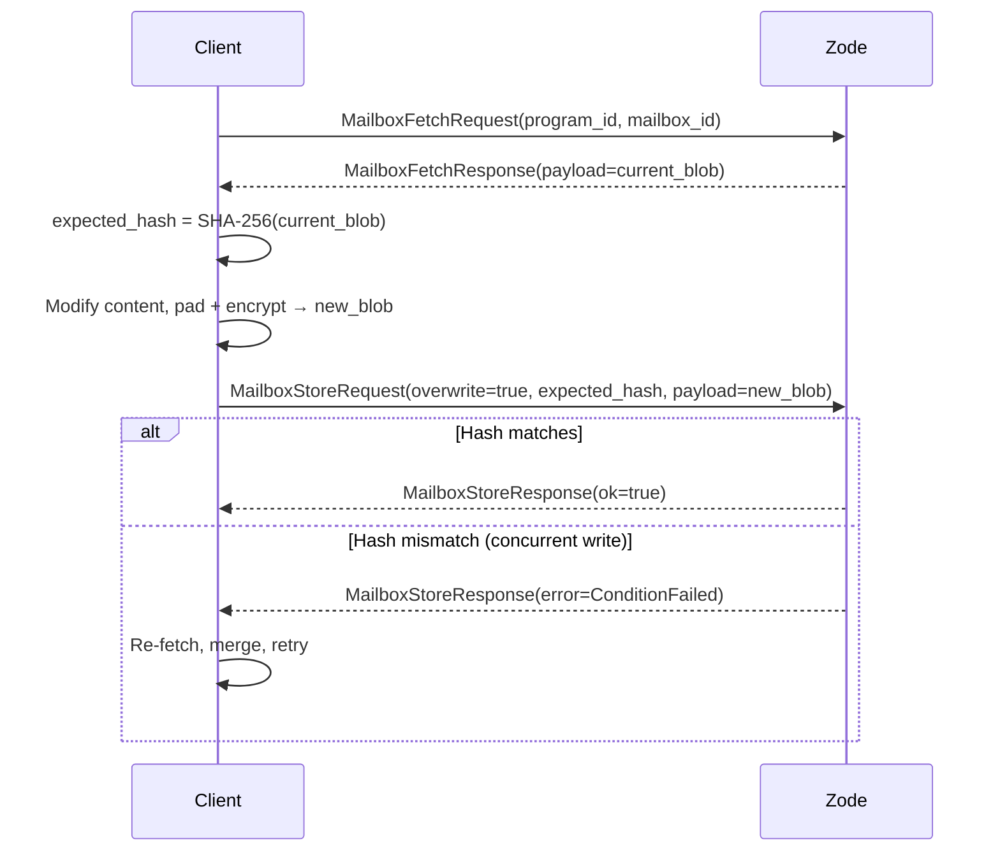

# ZFS v0.1.0 — Mailbox Protocol

## Purpose

This document specifies the **mailbox protocol**, a metadata-private storage layer for ZFS. The mailbox protocol reduces the Zode to an opaque key-value store scoped by program. Clients derive deterministic mailbox IDs via HKDF and store encrypted blobs. The Zode sees only `(program_id, mailbox_id, encrypted_blob)` — it cannot determine who wrote a blob, who can read it, or which blobs are related.

This is an alternative to the transparent protocol defined in [12-protocol](12-protocol.md), where heads, CIDs, sender identities, and signatures are visible on the wire.

## Design goals

| Goal | Description |
|------|-------------|
| **Payload confidentiality** | Zodes never see plaintext. (Unchanged from base spec.) |
| **Metadata privacy** | Zodes cannot determine sender identity, recipient set, logical grouping, ordering, or activity patterns. |
| **Program-scoped routing** | `program_id` remains visible. Zodes subscribe to and route by program. Hiding the program would require private information retrieval and is out of scope. |
| **Simple storage primitive** | The Zode implements a flat key-value store. No content addressing, no head tracking, no proof verification. |
| **Client-managed state** | Clients maintain all application state locally and reconstruct from the network when needed. |

## Threat model

The mailbox protocol protects against an **honest-but-curious Zode** (or network observer) that:

- Stores and serves data correctly but attempts to learn metadata.
- Can observe all writes and reads (mailbox IDs, blob sizes, timing).
- Can correlate traffic by IP address and connection timing.
- Cannot break the underlying cryptography (XChaCha20-Poly1305, X25519, ML-KEM-768).

**Known limitations (v0.1.0):**

- **No transport anonymity.** IP addresses are visible. Onion routing and mixnets are out of scope.
- **Timing correlation.** A Zode can correlate writes and reads that arrive close together from the same connection. Batch requests reveal which mailbox IDs are accessed together. Countermeasure: clients MAY include decoy mailbox IDs in batch requests.
- **Overwrite flag.** The `overwrite` flag in store requests is visible on the wire. A Zode can distinguish write-once slots from mutable slots. Applications should account for this when designing their slot layout.
- **Active attacks out of scope.** Integrity is assumed at the transport layer. A malicious Zode that drops or modifies data is not in the threat model.

## Architecture overview

```
┌──────────────────────────────────────────────────────┐
│                    Zode's view                        │
│                                                      │
│   program_id   │   mailbox_id    │   payload          │
│   (visible)    │   (opaque 32B)  │   (encrypted blob) │
│────────────────┼─────────────────┼────────────────────│
│   0xaa..       │   0x3f..        │   [1 KB]           │
│   0xaa..       │   0x71..        │   [1 KB]           │
│   0xaa..       │   0xb2..        │   [4 KB]           │
│   ...          │   ...           │   ...              │
└──────────────────────────────────────────────────────┘
```

The Zode is a **program-scoped key-value store**: `(program_id, mailbox_id) → encrypted_blob`. It cannot determine which rows are related, what type of data they contain, or who wrote or reads them.

## Mailbox ID

A `MailboxId` is a 32-byte opaque identifier:

```rust
#[derive(Clone, Copy, PartialEq, Eq, Hash, Serialize, Deserialize)]
pub struct MailboxId([u8; 32]);
```

Mailbox IDs are derived client-side via HKDF-SHA256 from a derivation key and an application-defined info string. The Zode stores and retrieves blobs by `(program_id, mailbox_id)` without knowledge of the derivation inputs.

### Derivation

```
derivation_key = HKDF-SHA256(
    ikm  = shared_secret,
    salt = "zfs:mailbox:v1",
    info = "zfs:mailbox:derive-key:v1"
)

mailbox_id = HKDF-SHA256(
    ikm  = derivation_key,
    salt = "zfs:mailbox:v1",
    info = application_defined_info_string
)
```

The `shared_secret` is typically a `SectorKey` or a value derived from one (see [10-crypto](10-crypto.md)). A **derivation key** is first extracted from the shared secret via HKDF to ensure the raw `SectorKey` is never used directly as HKDF input for mailbox IDs (it is reserved exclusively for AEAD encryption). This two-step process ensures cryptographic domain separation between mailbox ID derivation and payload encryption.

The `info` string is chosen by the application to produce distinct, non-colliding mailbox IDs for different slots. See [Info string conventions](#info-string-conventions) for recommended formats.

### Properties

- **Deterministic:** All parties sharing the same `shared_secret` and `info` string compute the same mailbox ID.
- **Unlinkable:** Different info strings produce unrelated mailbox IDs. The Zode cannot determine that two IDs were derived from the same secret.
- **Collision-resistant:** HKDF-SHA256 output is 32 bytes; collision probability is negligible.
- **Domain-separated:** The fixed salt `"zfs:mailbox:v1"` prevents accidental collision with other HKDF uses of the same key material.

### `derive_mailbox_id`

```rust
pub fn derive_mailbox_id(shared_secret: &[u8; 32], info: &[u8]) -> MailboxId;
```

Internally performs the two-step HKDF described above: derives the intermediate `derivation_key` from `shared_secret`, then derives the final `MailboxId` from `derivation_key` + `info`. The intermediate key is zeroized after use. Implemented in `zfs-crypto`.

### Info string conventions

Applications MUST construct info strings that are unambiguous and collision-free. The recommended format uses colon-separated structured fields:

```
"zfs:{program_short_name}:{purpose}:{...application_fields}"
```

**Examples:**

| Application | Info string | Description |
|-------------|-------------|-------------|
| Z Chat group inbox | `"zfs:zchat:inbox:{group_id_hex}:{seq}"` | Per-message write-once slot in a group |
| Z Chat group state | `"zfs:zchat:state:{group_id_hex}"` | Mutable slot for group membership state |
| ZID profile | `"zfs:zid:profile:{identity_id_hex}"` | Public profile blob |
| ZID device key announce | `"zfs:zid:device:{identity_id_hex}:{machine_id_hex}:{epoch}"` | Per-device key publication |

Rules:
- Info strings MUST begin with `"zfs:"`.
- Variable-length fields (IDs, hashes) MUST be hex-encoded to avoid delimiter collisions.
- Applications MUST NOT reuse the same info string for slots with different semantics.

## Wire protocol

### Protocol string

```
/zfs/mailbox/1.0.0
```

Separate from the base protocol (`/zfs/1.0.0`). A Zode MAY serve both protocols simultaneously (see [Protocol coexistence](#protocol-coexistence)). Serialization is canonical CBOR, matching [11-core-types](11-core-types.md).

### Request / Response enums

The mailbox protocol uses its own top-level enums, separate from the base protocol's `ZfsRequest` / `ZfsResponse`:

```rust
pub enum MailboxRequest {
    Store(MailboxStoreRequest),
    Fetch(MailboxFetchRequest),
    BatchStore(MailboxBatchStoreRequest),
    BatchFetch(MailboxBatchFetchRequest),
}

pub enum MailboxResponse {
    Store(MailboxStoreResponse),
    Fetch(MailboxFetchResponse),
    BatchStore(MailboxBatchStoreResponse),
    BatchFetch(MailboxBatchFetchResponse),
}
```

### Error codes

The mailbox protocol extends the base `ErrorCode` enum (defined in [11-core-types](11-core-types.md)) with mailbox-specific variants rather than defining a separate enum:

```rust
pub enum ErrorCode {
    // --- base protocol variants (unchanged) ---
    StorageFull,
    ProofInvalid,
    PolicyReject,
    NotFound,
    InvalidPayload,
    ProgramMismatch,
    // --- mailbox protocol additions ---
    SlotOccupied,      // write-once slot already written
    BatchTooLarge,     // batch exceeds entry or payload limits
    ConditionFailed,   // expected_hash did not match current content
}
```

Wire serialization distinguishes variants by integer tag in CBOR. Existing base protocol messages never produce the mailbox-specific variants; mailbox messages never produce `ProofInvalid`.

### `MailboxStoreError`

The internal storage error type used by the `MailboxStore` trait (not sent on the wire):

```rust
#[derive(Debug, Error)]
pub enum MailboxStoreError {
    #[error("storage full")]
    StorageFull,
    #[error("slot occupied")]
    SlotOccupied,
    #[error("condition failed: expected hash mismatch")]
    ConditionFailed,
    #[error("policy reject")]
    PolicyReject,
    #[error("backend I/O error: {0}")]
    Backend(String),
    #[error("encode error: {0}")]
    Encode(String),
    #[error("decode error: {0}")]
    Decode(String),
}
```

`MailboxStoreError` maps to wire `ErrorCode` variants where applicable; `Backend`, `Encode`, and `Decode` map to `InvalidPayload` on the wire.

### Single store

```rust
pub struct MailboxStoreRequest {
    pub program_id: ProgramId,
    pub mailbox_id: MailboxId,
    pub payload: Vec<u8>,
    pub overwrite: bool,
    pub expected_hash: Option<[u8; 32]>,
    pub ttl_seconds: Option<u64>,
}

pub struct MailboxStoreResponse {
    pub ok: bool,
    pub error: Option<ErrorCode>,
}
```

- `overwrite: false` — write-once. Rejects with `SlotOccupied` if the key already exists.
- `overwrite: true` — mutable overwrite. If `expected_hash` is `None`, overwrite is unconditional (last-write-wins). If `expected_hash` is `Some(hash)`, the Zode computes `SHA-256(current_payload)` and rejects with `ConditionFailed` if it does not match. This provides compare-and-swap semantics for mutable slots.
- `expected_hash` with `overwrite: false` is invalid and rejected with `InvalidPayload`.
- `ttl_seconds` — optional hint to the Zode for how long the slot should be retained. The Zode MAY use this as an eviction hint but is not required to honor it. A value of `None` means no preference (Zode applies its default eviction policy). The TTL is **not** a guarantee — clients must tolerate early eviction or retention beyond the TTL.

### Single fetch

```rust
pub struct MailboxFetchRequest {
    pub program_id: ProgramId,
    pub mailbox_id: MailboxId,
}

pub struct MailboxFetchResponse {
    pub payload: Option<Vec<u8>>,
    pub error: Option<ErrorCode>,
}
```

Returns `None` payload (no error) if the mailbox has not been written.

### Batch store

```rust
pub struct MailboxBatchStoreRequest {
    pub program_id: ProgramId,
    pub entries: Vec<MailboxBatchStoreEntry>,  // max 64
}

pub struct MailboxBatchStoreEntry {
    pub mailbox_id: MailboxId,
    pub payload: Vec<u8>,
    pub overwrite: bool,
    pub expected_hash: Option<[u8; 32]>,
    pub ttl_seconds: Option<u64>,
}

pub struct MailboxBatchStoreResponse {
    pub results: Vec<MailboxStoreResult>,      // parallel to entries
    pub error: Option<ErrorCode>,              // batch-level error only
}

pub struct MailboxStoreResult {
    pub ok: bool,
    pub error: Option<ErrorCode>,              // per-entry error
}
```

`results[i]` corresponds to `entries[i]`. The top-level `error` field is set only for batch-level failures (e.g., `ProgramMismatch`, `BatchTooLarge`). Per-entry failures (e.g., `SlotOccupied`, `StorageFull`, `ConditionFailed`) appear in `results[i].error`.

### Batch fetch

```rust
pub struct MailboxBatchFetchRequest {
    pub program_id: ProgramId,
    pub mailbox_ids: Vec<MailboxId>,  // max 64
}

pub struct MailboxBatchFetchResponse {
    pub results: Vec<Option<Vec<u8>>>,         // parallel to mailbox_ids
    pub error: Option<ErrorCode>,              // batch-level error only
}
```

`results[i]` corresponds to `mailbox_ids[i]`. A `None` entry means the mailbox has not been written (not an error).

### Batch limits

- Maximum **64 entries** per batch request. Clients split larger operations across multiple batches.
- Maximum **4 MB total payload** per batch request. The Zode MUST reject batches exceeding this limit with `BatchTooLarge`. This ensures that even with the largest padding bucket (256 KB per entry), batches stay within a reasonable size (64 × 256 KB = 16 MB worst case with decoys; 4 MB enforced on actual payload bytes).
- Each entry within a batch is independent — a failure on one entry does not affect others.

### Operation summary

| Operation | Wire type | Purpose |
|-----------|-----------|---------|
| `put` | `MailboxStoreRequest` | Write a single slot |
| `get` | `MailboxFetchRequest` | Read a single slot |
| `batch_put` | `MailboxBatchStoreRequest` | Write up to 64 slots in one round trip |
| `batch_get` | `MailboxBatchFetchRequest` | Read up to 64 slots in one round trip |

No machine_did, no signature, no head, no key_envelope, no CID on the wire.

## Payload encryption

All mailbox payloads MUST be encrypted before storage. The Zode stores opaque bytes; encryption and decryption are performed client-side.

### Encryption

Payloads are encrypted with a `SectorKey` using XChaCha20-Poly1305 (same primitives as [10-crypto](10-crypto.md)):

```
encrypted_payload = XChaCha20-Poly1305(
    key       = SectorKey,
    nonce     = random 192-bit,
    plaintext = padded(serialized_content),
    aad       = program_id (32 bytes) || mailbox_id (32 bytes)
)
```

**AAD is mandatory.** The AAD MUST include `program_id || mailbox_id` at minimum. This binds the ciphertext to both its program and its specific slot, preventing cross-program and cross-slot ciphertext relocation attacks. Applications MAY append additional context (e.g., a version tag) after the mandatory fields:

```
AAD = program_id (32 bytes) || mailbox_id (32 bytes) [|| additional_context]
```

### Padding

To resist payload-size analysis, clients MUST pad serialized content to fixed size buckets before encryption:

| Content size | Padded to |
|-------------|-----------|
| 0 – 1 KB   | 1 KB |
| 1 – 4 KB   | 4 KB |
| 4 – 16 KB  | 16 KB |
| 16 – 64 KB | 64 KB |
| 64 – 256 KB | 256 KB |

All slot types (data, metadata, control) MUST use the same padding buckets so they are indistinguishable by size. The minimum padded size is **1 KB**.

#### Padding scheme: length-prefix + zero-fill

Padding uses a **4-byte little-endian length prefix** followed by zero-fill to the bucket boundary:

```
padded = content_length (4 bytes, little-endian) || content || 0x00 * (bucket_size - 4 - content_length)
```

On decryption, the receiver reads the 4-byte length prefix, extracts `content[0..length]`, and discards the trailing zeros.

This replaces PKCS#7-style padding, which is limited to 255 bytes of padding and cannot reach the 1 KB minimum bucket size for small content. The length-prefix scheme supports arbitrary content sizes up to 2^32 - 1 bytes.

**Padding is implemented in `zfs-crypto`** alongside `encrypt_sector` / `decrypt_sector`:

```rust
pub fn pad_to_bucket(content: &[u8]) -> Vec<u8>;
pub fn unpad_from_bucket(padded: &[u8]) -> Result<Vec<u8>, CryptoError>;
```

## Zode storage model

### Storage backend

| Column family | Key | Value |
|--------------|-----|-------|
| **mailboxes** | `program_id (32B) \|\| mailbox_id (32B)` | `payload (encrypted blob)` |

A single column family with 64-byte composite keys. No block store, head store, or program index is needed. This column family is added to the existing `RocksStorage` instance alongside the base protocol's `blocks`, `heads`, `program_index`, and `metadata` column families.

### Operations

| Operation | Behavior |
|-----------|----------|
| `put(program_id, mailbox_id, payload, overwrite, expected_hash)` | Write blob. If `overwrite=false` and key exists, reject with `SlotOccupied`. If `overwrite=true` and `expected_hash` is `Some`, compare `SHA-256(current)` and reject with `ConditionFailed` on mismatch. If `overwrite=true` and `expected_hash` is `None`, overwrite unconditionally. |
| `get(program_id, mailbox_id)` | Return payload if key exists, or `None`. |
| `batch_put(program_id, entries[])` | Up to 64 puts. Each entry is independent (partial success allowed). |
| `batch_get(program_id, mailbox_ids[])` | Up to 64 gets. Returns parallel array of payloads (`None` for missing keys). |

Delete is **local-only** for Zode garbage collection — not exposed on the wire. Zodes MAY use `ttl_seconds` hints from store requests as input to eviction decisions. Zodes MAY also implement time-based or size-based eviction policies independently.

### MailboxStore trait

```rust
pub trait MailboxStore {
    fn put(
        &self,
        program_id: &ProgramId,
        mailbox_id: &MailboxId,
        payload: &[u8],
        overwrite: bool,
        expected_hash: Option<&[u8; 32]>,
    ) -> Result<(), MailboxStoreError>;

    fn get(
        &self,
        program_id: &ProgramId,
        mailbox_id: &MailboxId,
    ) -> Result<Option<Vec<u8>>, MailboxStoreError>;

    fn batch_put(
        &self,
        program_id: &ProgramId,
        entries: &[MailboxBatchStoreEntry],
    ) -> Result<Vec<MailboxStoreResult>, MailboxStoreError>;

    fn batch_get(
        &self,
        program_id: &ProgramId,
        mailbox_ids: &[MailboxId],
    ) -> Result<Vec<Option<Vec<u8>>>, MailboxStoreError>;

    fn stats(&self) -> Result<MailboxStorageStats, MailboxStoreError>;
}
```

### Storage statistics

```rust
pub struct MailboxStorageStats {
    pub db_size_bytes: u64,
    pub slot_count: u64,
    pub program_count: u64,
}
```

### Policy enforcement

The Zode **can** enforce:

- **Per-program storage quotas**: Total bytes stored for a `program_id`.
- **Per-slot size limits**: Maximum blob size (e.g., 256 KB).
- **Program allowlist**: Only accept writes for subscribed `program_id`s.
- **Rate limiting**: Maximum requests per second per connection or per program. Recommended default: 100 req/s per connection.

The Zode **cannot** enforce (by design):

- Per-group or per-user limits (these concepts are invisible).
- Payload format validation (payload is opaque).
- Write authorization (any client that can connect can write to any mailbox_id within an allowed program).

## Replication

Replication is **client-driven**: the client sends the same store request to `R` Zodes (replication factor). At-least-one-success semantics apply, matching the base protocol's `upload()` behavior.

GossipSub topics (`prog/{program_id_hex}`) are used for **peer discovery and presence only** — Zodes subscribe to program topics to signal which programs they serve. Data propagation is not done via GossipSub; the base protocol's `GossipBlock` type does not apply to opaque mailbox blobs.

## Notification and polling

The mailbox protocol is **pull-based** in v0.1.0. Clients discover new writes by polling `batch_get` on known mailbox IDs.

### Polling guidance

- Clients SHOULD use exponential backoff when no new data is found, up to a maximum interval (e.g., 30 seconds).
- Clients SHOULD include decoy mailbox IDs in batch fetch requests to mask which IDs they are actually interested in.
- Clients SHOULD avoid polling from a single connection at high frequency to limit timing correlation.

### Future: push notifications

A future version MAY add a lightweight notification mechanism:

```rust
pub struct MailboxSubscribeRequest {
    pub program_id: ProgramId,
    pub mailbox_ids: Vec<MailboxId>,
}

pub struct MailboxNotification {
    pub mailbox_id: MailboxId,
    pub updated_at_ms: u64,
}
```

This would allow Zodes to push `MailboxNotification` events when subscribed slots are written. The notification contains only the `mailbox_id` and a timestamp — no payload — so the client still performs a fetch to retrieve the content. This is deferred from v0.1.0 because push subscriptions reveal which mailbox IDs a client is interested in, creating a metadata correlation vector.

## Protocol coexistence

### Multiplexing

Both `/zfs/1.0.0` (base protocol) and `/zfs/mailbox/1.0.0` are registered as separate libp2p request-response protocols on the same Swarm. libp2p's built-in protocol negotiation (multistream-select) handles routing — each inbound stream is matched to the correct handler by its protocol string. No application-level multiplexing is needed.

### Shared infrastructure

| Resource | Shared? | Notes |
|----------|---------|-------|
| libp2p Swarm | Yes | Single Swarm with both protocols registered |
| GossipSub topics | Yes | `prog/{program_id_hex}` used for discovery by both protocols |
| RocksDB instance | Yes | Mailbox uses its own `mailboxes` column family alongside base protocol CFs |
| Policy engine | Yes | Program allowlist and quotas apply uniformly to both protocols |
| Metrics surface | Separate counters | `mailbox_puts_total`, `mailbox_gets_total`, etc. alongside base protocol metrics |

### Discovery

Clients discover which protocols a Zode supports via libp2p's Identify protocol, which advertises the list of supported protocol strings. A client connecting to a Zode that does not advertise `/zfs/mailbox/1.0.0` falls back to the base protocol (or raises an error if mailbox is required).

## Versioning

### Protocol version string

The protocol string `/zfs/mailbox/1.0.0` follows semver:

- **Major** (`1`): Breaking wire-format changes. Incompatible with prior major versions.
- **Minor** (`0`): Additive changes (new optional fields, new request types). Backward-compatible.
- **Patch** (`0`): Bug fixes in spec language. No wire changes.

### Negotiation

A Zode MAY advertise multiple mailbox protocol versions (e.g., `/zfs/mailbox/1.0.0` and `/zfs/mailbox/2.0.0`). Clients select the highest mutually supported version via multistream-select. Within a major version, new optional fields (e.g., `ttl_seconds`, `expected_hash`) are silently ignored by older implementations that do not recognize them, because CBOR deserialization with `#[serde(default)]` skips unknown fields.

### Upgrade path

When a breaking change is needed:
1. Release the new major version alongside the old one.
2. Zodes advertise both versions during a transition period.
3. Deprecate the old version after adoption threshold is reached.
4. Remove the old version in a subsequent release.

## Visibility summary

### What the Zode sees

| Information | Visible? |
|------------|----------|
| `program_id` | Yes — routing and policy |
| `mailbox_id` | Yes — opaque 32 bytes, cannot reverse |
| Payload size (post-encryption) | Yes — mitigated by padding |
| `overwrite` flag | Yes — distinguishes write-once from mutable slots |
| `expected_hash` presence | Yes — reveals the client is doing conditional writes |
| `ttl_seconds` value | Yes — reveals client's retention preference |
| Write timing | Yes — when a put arrives |
| Read timing | Yes — when a get arrives |
| Which mailbox IDs are batched together | Yes — within a single batch request |
| IP address of client | Yes — transport-level |

### What the Zode cannot see

| Information | Why hidden |
|------------|-----------|
| Who wrote a blob | Identity is inside encrypted payload (or absent) |
| Who can read a blob | Key material is never on the wire |
| Which blobs are related | HKDF outputs are unlinkable without the shared secret |
| Blob content or structure | Encrypted and padded |
| Ordering, versioning, timestamps | Inside encrypted payload |
| Number of logical groups | Cannot distinguish groups from unrelated blobs |

## Comparison with base protocol

| Aspect | Base protocol ([12-protocol](12-protocol.md)) | Mailbox protocol |
|--------|---------------------------------------------|-----------------|
| Zode role | Indexes heads, verifies proofs, validates structure | Flat key-value put/get per program |
| Metadata visible to Zode | Sender, recipients, sector, version, timestamps, signatures | Only `program_id` |
| Content addressing | Zode verifies CID = SHA-256(ciphertext) | No CIDs; Zode stores opaque blobs |
| Proof verification | Zode verifies Valid-Sector proofs | Not applicable; client-verified if needed |
| Head management | Zode stores and serves structured `Head`s | No heads; client manages all state |
| Client complexity | Low — Zode manages state | Higher — client manages all state |
| Replication | GossipSub + request-response | Client-driven; GossipSub for discovery only |
| Conflict detection | Version-based via Head lineage | Optional via `expected_hash` (CAS) |

## Sequence diagrams

### Client store (single slot)



### Client fetch (single slot)



### Batch fetch with decoys



### Client-driven replication (R = 2)



### Conditional update (CAS)



## Limitations and future work

### v0.1.0 limitations

- **No transport anonymity**: IP addresses are visible. Onion routing / mixnet integration is deferred.
- **Timing correlation**: Batch requests and write patterns can leak access structure. Decoy IDs are a partial countermeasure but are not mandatory in v0.1.0.
- **No Zode-side validation**: Malicious clients can write invalid or adversarial data. Applications must validate after decryption.
- **No wire-level write authorization**: Any client that can connect and knows a `program_id` can write to any `mailbox_id`. Access control is an application-layer concern.
- **Write-once slot squatting**: Because there is no write authorization, an attacker who can predict a `mailbox_id` (e.g., by knowing the `shared_secret`) can pre-write to a write-once slot, permanently blocking the legitimate writer. Mitigations: (1) applications SHOULD use high-entropy, unpredictable info strings for write-once slots; (2) applications MAY use mutable slots with `expected_hash` instead of write-once slots where contention is possible; (3) future versions may add write-authorization tokens (see below).
- **Polling latency**: Clients must poll to discover new writes. High-frequency polling wastes bandwidth; low-frequency polling increases latency. Applications should tune polling intervals to their use case.
- **`expected_hash` reveals conditional-write intent**: The Zode can observe that a client is performing compare-and-swap, which reveals that the slot is being concurrently accessed. Applications that require this to be hidden should use unconditional overwrites and handle conflicts at the application layer.
- **`ttl_seconds` is a hint only**: Zodes are not obligated to honor TTLs. Clients must tolerate both early eviction and indefinite retention.

### Future enhancements

- **Decoy traffic**: Periodic writes to random mailbox IDs to mask real activity timing.
- **Epoch-based ID rotation**: Rotate derivation inputs periodically so the Zode cannot track long-lived mutable slots.
- **Private information retrieval**: Fetch without revealing which `mailbox_id` is requested.
- **Write authorization tokens**: Zode-verified tokens to restrict who can write to specific slots or programs. Could use blind signatures so the Zode verifies a valid token without learning the writer's identity.
- **Push notifications**: `MailboxSubscribeRequest` for Zode-pushed slot-update events (see [Notification and polling](#notification-and-polling)).

## Implementation notes

- **`zfs-core`**: Gains `MailboxId` (new module `mailbox_id.rs`), and mailbox wire types (`MailboxRequest`, `MailboxResponse`, and their inner structs in a new `mailbox_protocol.rs` module). The existing `ErrorCode` enum is extended with `SlotOccupied`, `BatchTooLarge`, and `ConditionFailed` variants. `MailboxStoreError` is defined here as a shared error type.
- **`zfs-crypto`**: Gains `derive_mailbox_id(shared_secret, info) -> MailboxId` — performs the two-step HKDF derivation (extract derivation key, then derive mailbox ID) with salt `"zfs:mailbox:v1"`. Also gains `pad_to_bucket(content) -> Vec<u8>` and `unpad_from_bucket(padded) -> Result<Vec<u8>, CryptoError>` for the length-prefix + zero-fill padding scheme. The existing `SectorKey`, `encrypt_sector`, `decrypt_sector`, `wrap_sector_key`, `unwrap_sector_key` are unchanged and reused for payload encryption.
- **`zfs-storage`**: Gains a `MailboxStore` trait with `put`, `get`, `batch_put`, `batch_get`, and `stats`. The `RocksStorage` implementation adds a `mailboxes` column family to its existing set (`blocks`, `heads`, `program_index`, `metadata`, `mailboxes`). The `put` operation with `expected_hash` uses a read-modify-write under a RocksDB single-key lock (or merge operator) to ensure atomicity. The existing base protocol traits (`BlockStore`, `HeadStore`, `ProgramIndex`) are unchanged.
- **`zfs-net`**: Registers `/zfs/mailbox/1.0.0` as a separate request-response protocol on the same libp2p Swarm. Uses multistream-select for protocol negotiation. The base protocol's `ZfsRequest` / `ZfsResponse` and GossipSub topics are unchanged.
- **`zfs-zode`**: Gains a `MailboxStore`-backed request handler (simpler than the base handler — no CID verification, no proof verification, no head management). Policy enforcement (program allowlist, quotas, rate limiting) applies to both protocols. The `expected_hash` check is performed inside the storage layer, not the handler.
- **`zfs-sdk`**: Gains `derive_mailbox_id`, `pad_to_bucket`, `unpad_from_bucket`, and batch operation helpers for client-driven replication. Provides a convenience `mailbox_encrypt(sector_key, program_id, mailbox_id, content) -> Vec<u8>` that pads, sets the mandatory AAD, and encrypts in one call. Application-specific logic (group management, message ordering, membership) lives above this layer in application code.
